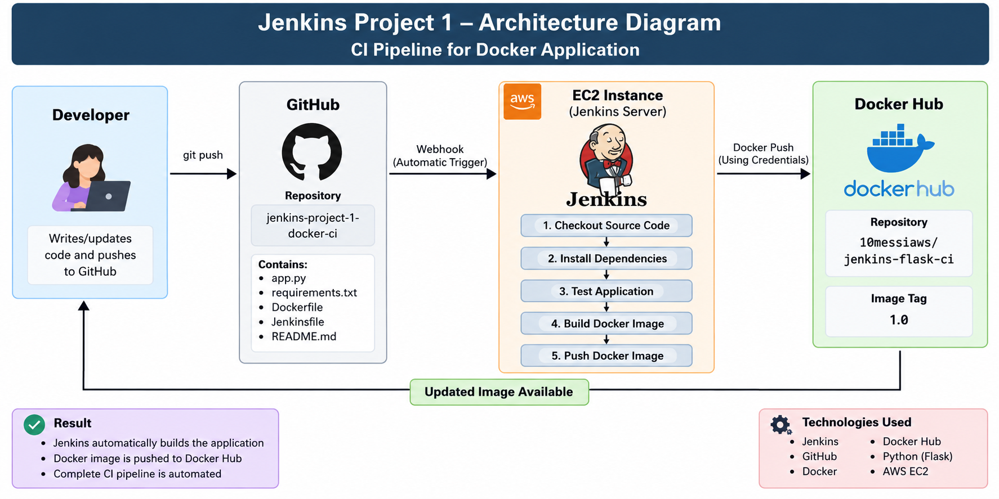

# Jenkins Project 1 — CI Pipeline for Docker Application

## 📌 Project Overview

This project demonstrates a Continuous Integration (CI) pipeline using Jenkins.

A Flask application is stored in GitHub. Jenkins automatically detects changes through a GitHub Webhook, checks out the source code, installs dependencies, tests the application, builds a Docker image, and pushes the Docker image to Docker Hub.

This project demonstrates how Jenkins can automate the application build and Docker image publishing process.

---

## 🏗️ Architecture

Developer
    |
    v
GitHub Repository
    |
    | GitHub Webhook
    v
Jenkins
    |
    +--> Checkout Source Code
    |
    +--> Install Dependencies
    |
    +--> Test Application
    |
    +--> Build Docker Image
    |
    +--> Push Docker Image
    |
    v
Docker Hub
    |
    v
10messiaws/jenkins-flask-ci:1.0

---

## 🔄 CI Pipeline Flow

1. Developer pushes code to GitHub.
2. GitHub Webhook triggers Jenkins automatically.
3. Jenkins checks out the latest source code.
4. Jenkins installs the Python dependencies.
5. Jenkins performs an application syntax test.
6. Jenkins builds the Docker image.
7. Jenkins authenticates with Docker Hub using Jenkins credentials.
8. Jenkins pushes the Docker image to Docker Hub.

---

## 🛠️ Technologies Used

- Jenkins
- GitHub
- Git
- Docker
- Docker Hub
- Python
- Flask
- Jenkins Pipeline
- GitHub Webhooks
- AWS EC2

---

## 📂 Project Structure

    project-1-docker-ci/
    ├── app.py
    ├── requirements.txt
    ├── Dockerfile
    ├── Jenkinsfile
    └── README.md

---

## 🐍 Flask Application

The application is a simple Flask web application running on port 5000.

---

## 🐳 Docker

The Flask application is packaged into a Docker image.

Docker image:

    10messiaws/jenkins-flask-ci:1.0

The Docker image is built automatically by Jenkins during the pipeline.

---

## 🔧 Jenkins Pipeline Stages

### 1. Checkout

Jenkins retrieves the source code from GitHub.

### 2. Install Dependencies

Jenkins installs the Python packages specified in requirements.txt.

### 3. Test Application

Jenkins performs a Python syntax check using py_compile.

### 4. Build Docker Image

Jenkins builds the Docker image from the Dockerfile.

### 5. Push Docker Image

Jenkins securely authenticates with Docker Hub using Jenkins credentials and pushes the Docker image.

---

## 🔐 Jenkins Credentials

Docker Hub authentication is handled using Jenkins Credentials. The Docker Hub access token is stored securely in Jenkins and is not hardcoded inside the Jenkinsfile.

Credential ID:

    dockerhub-credentials

---

## 🔔 GitHub Webhook

A GitHub Webhook is configured to automatically trigger Jenkins whenever code is pushed to the repository.

---

## ☁️ AWS Infrastructure

Jenkins is hosted on an AWS EC2 instance running Jenkins, Docker, Python, and required build tools.

---

## 🎯 Project Objective

The objective is to understand how Jenkins can automate a Continuous Integration workflow from GitHub source code through Docker image publishing.

---

## ✅ Project Result

The CI pipeline successfully checks out the application, installs dependencies, tests the Flask application, builds the Docker image, and pushes the image to Docker Hub.
